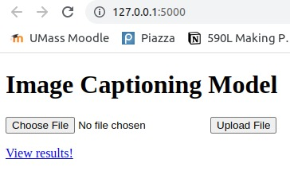
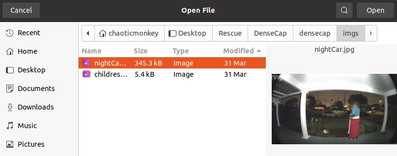
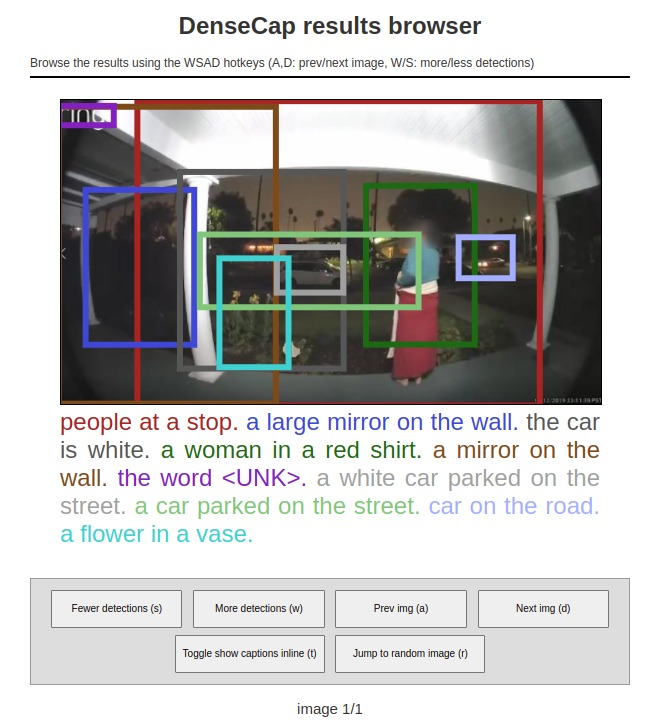

# Dense Image Captioning

## Motivation

Processing images and videos collected from public CCTV, doorbell cameras, etc. is a crucial part of an investigation that can help in tasks such as creating a timeline of events. In missing persons investigations, the speed at which the evidence is processed in the first few hours and days is critical. By automating processing the media, storing it in smart, queryable databases, personnel time and resources can be freed up to other tasks and investigations can be accelerated. With that direction, this project is aimed at creating image captions (videos can be seen as a series of images) and store them to be queried.

## Features

The model detects objects in images and describes them in natural language, which we call captions. Here are a few example outputs:


## Tech Stack

For generating dense image captions, we adapted the pre-trained models from the code for the paper:
**[DenseCap: Fully Convolutional Localization Networks for Dense Captioning](http://cs.stanford.edu/people/karpathy/densecap/)**,
<br>
[Justin Johnson](http://cs.stanford.edu/people/jcjohns/)\*,
[Andrej Karpathy](http://cs.stanford.edu/people/karpathy/)\*,
[Li Fei-Fei](http://vision.stanford.edu/feifeili/),
<br>
(\* equal contribution)
<br>

The model is implemented in Torch, which is built in Lua. Python's Flask is a web framework, utilized in this service to work as the frontend to make it easier to upload images and view the results. Azure is used for file storage and additional Python and Lua packages were used to combine the elements.

## Improvements

These further improvements are planned to the service:
* **GPU Acceleration**: By running the model on a GPU, the image processing can be accelerated much faster.
* **PyTorch or TensorFlow Model**: Currently, the model is run on Lua based Torch framework and as of April 2022, its community has been in steady decline. Translating the model to a better maintained ML framework such as PyTorch and TensorFlow will allow future proofing the feature, among other advantages.
* **Containerization using Docker**: To integrate this service UMass Rescue Lab's backend


## How to use

### Installing dependencies
The captioning is priarmily implemented in [Torch](http://torch.ch/), and depends on the following packages: [torch/torch7](https://github.com/torch/torch7), [torch/nn](https://github.com/torch/nn), [torch/nngraph](https://github.com/torch/nngraph), [torch/image](https://github.com/torch/image), [lua-cjson](https://luarocks.org/modules/luarocks/lua-cjson), [qassemoquab/stnbhwd](https://github.com/qassemoquab/stnbhwd), [jcjohnson/torch-rnn](https://github.com/jcjohnson/torch-rnn)

After installing torch, you can install / update these dependencies by running the following:

```bash
luarocks install torch
luarocks install nn
luarocks install image
luarocks install lua-cjson
luarocks install https://raw.githubusercontent.com/qassemoquab/stnbhwd/master/stnbhwd-scm-1.rockspec
luarocks install https://raw.githubusercontent.com/jcjohnson/torch-rnn/master/torch-rnn-scm-1.rockspec
```
### Pretrained model

Download the pretrained model by running the following script through:

```bash
 sh scripts/download_pretrained_model.sh
 ```
 
 This will download a zipped version of the model (about 1.1 GB) to `data/models/densecap/densecap-pretrained-vgg16.t7.zip`, unpack
 it to `data/models/densecap/densecap-pretrained-vgg16.t7` (about 1.2 GB) and then delete the zipped version.

### Image Processing

Run the following script to start the Frontend web framework:

```bash
python frontend.py
```

and go to http://127.0.0.1:5000/ on your web browser. You should see the following:



Click on *Choose File*, which will open a window. Select the image(s) that you wish to process:



Once the processing is complete, click on *View Results!*, where you can see the results on your browser similar to this:



*Fewer Detections (s)* and *More detections (w)* can be used to reduce or increase the number of captions displayed on the image. The color of the captions correlate to where in the image the object can be found. For example, the car bounded by the grey box has the caption *a white car parked on the street*. The captions are written in descending order of how confident the model is about a particular caption. Depending on the complexity of the image, it is advised to look at the first 25 captions to make sure no discernable object is omitted from queries.


All code for dense image captions is credited:
```
@inproceedings{densecap,
  title={DenseCap: Fully Convolutional Localization Networks for Dense Captioning},
  author={Johnson, Justin and Karpathy, Andrej and Fei-Fei, Li},
  booktitle={Proceedings of the IEEE Conference on Computer Vision and 
             Pattern Recognition},
  year={2016}
}
```